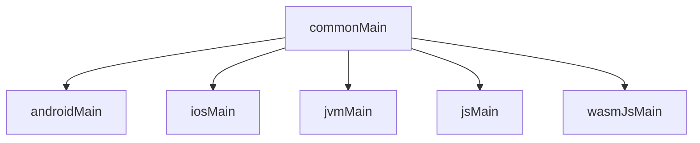

# KMP Ruta 7 Dias (Android -> Multiplataforma)

Esta guia esta aterrizada a tu proyecto actual `:composeApp` y a las targets activas:
- Android
- iOS (arm64 + simulator arm64)
- JVM (desktop)
- JS
- Wasm

## Mapa rapido del proyecto



- `commonMain`: logica compartida + UI compartible.
- `*Main`: adaptadores nativos.
- `commonTest`: pruebas de logica compartida.

## Dia 1: Anatomia KMP real

Objetivo:
- Entender `kotlin { ... }`, targets y source sets.

Checklist:
1. Lee `composeApp/build.gradle.kts`.
2. Identifica dependencias de `commonMain` vs `androidMain` vs `jvmMain`.
3. Dibuja que parte de tu feature vive en comun y que parte es nativa.

Validacion:
```bash
./gradlew :composeApp:tasks
```

## Dia 2: Source sets y reglas de dependencia

Objetivo:
- Mover logica de UI a `commonMain`.

Implementado en este repo:
- `LearningStore` (estado + eventos) vive en `commonMain`.
- La pantalla usa ese estado sin APIs Android-only.

Checklist:
1. Todo lo reusable va a `commonMain`.
2. Si usa SDK nativo, va en `<target>Main`.

## Dia 3: expect/actual

Objetivo:
- Definir contrato comun y resolverlo por plataforma.

Implementado en este repo:
- `ClockProvider` + `expect class PlatformClockProvider()`.
- `actual` en Android/iOS/JVM/JS/Wasm.

Archivos clave:
- `composeApp/src/commonMain/kotlin/dev/andyromero/clock/PlatformClockProvider.kt`
- `composeApp/src/androidMain/kotlin/dev/andyromero/clock/PlatformClockProvider.android.kt`
- `composeApp/src/iosMain/kotlin/dev/andyromero/clock/PlatformClockProvider.ios.kt`

## Dia 4: Estado compartido (MVI simple)

Objetivo:
- Flujo unidireccional de datos.

Implementado en este repo:
- `LearningUiState`
- `LearningIntent`
- `LearningEffect`
- `LearningStore.reduce(...)`

Regla:
- UI renderiza `state`.
- UI dispara `intent`.
- Store produce nuevo estado (+ efecto opcional).

## Dia 5: Recursos y limites de plataforma

Objetivo:
- Usar recursos multiplataforma y separar host-specific.

Implementado en este repo:
- Strings en `composeResources/values/strings.xml`.
- UI los consume con `stringResource(Res.string...)`.

Regla:
- Textos e imagenes compartibles: `composeResources`.
- Integracion de host (Activity/ViewController/Window): target-specific.

## Dia 6: Testing multiplataforma

Objetivo:
- Cubrir logica en `commonTest`.

Implementado en este repo:
- `LearningStoreTest` prueba:
  1. ciclo de dias,
  2. refresh de clock,
  3. toggle de conceptos.

Validacion:
```bash
./gradlew :composeApp:allTests
```

## Dia 7: Hardening para produccion

Checklist recomendado:
1. Verifica dependencias por source set (sin fugas Android-only a `commonMain`).
2. Compila matriz minima en cada PR:
   - Android
   - iOS simulator
   - JVM
3. Revisa tiempos de build y errores por target web (JS/Wasm).
4. Mantiene pruebas en `commonTest` para toda logica compartida.

Comandos utiles:
```bash
./gradlew :composeApp:compileDebugKotlinAndroid
./gradlew :composeApp:iosSimulatorArm64Test
./gradlew :composeApp:jvmTest
./gradlew :composeApp:jsTest
```

## Criterio de exito semanal

Una pantalla/feature pequena:
1. con estado compartido en `commonMain`,
2. con al menos un `expect/actual`,
3. con pruebas en `commonTest`,
4. ejecutable en Android e iOS, y compilable para desktop/web sin cambiar logica.

